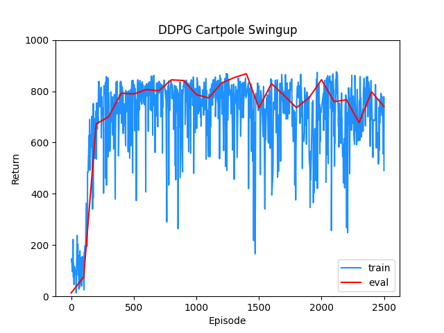
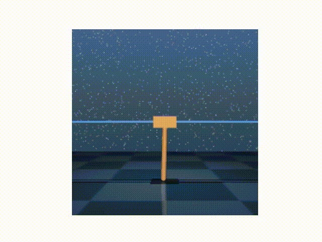
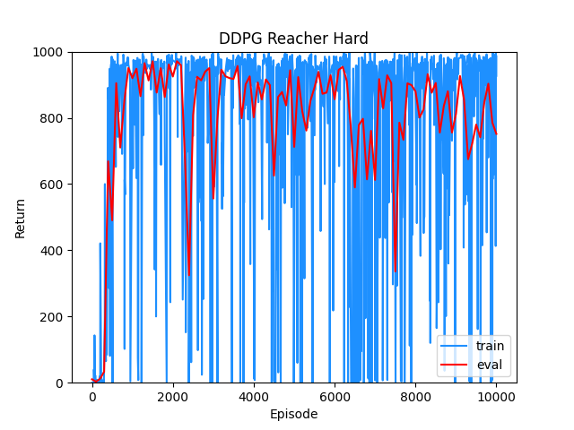
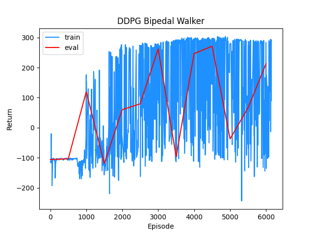
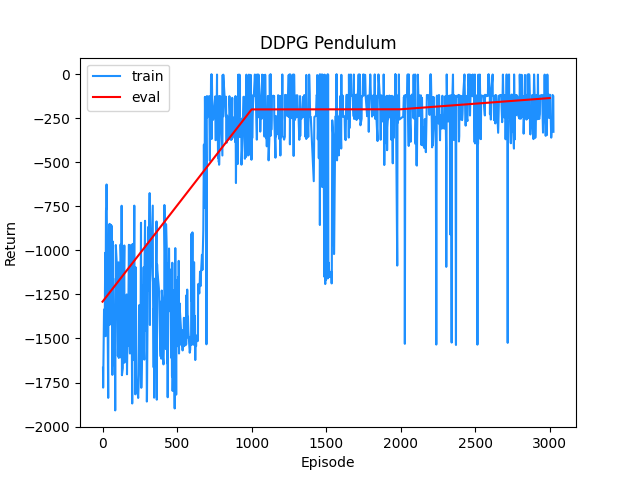
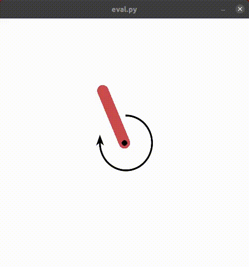

# Deep Deterministic Policy Gradient (DDPG)
This repository contains a clean and minimal implementation of Deep Deterministic Policy Gradient (DDPG) algorithm in Pytorch.

DDPG is a model-free deep RL algorithm for continuous action spaces. It adopts an off-policy actor-critic approach and uses deterministic policies.

You can find more details about how DDPG works in my accompanying blog post [here](https://adi3e08.github.io/blog/ddpg/).

## References
* Timothy P Lillicrap, Jonathan J Hunt, Alexander Pritzel, Nicolas Heess, Tom Erez, Yuval Tassa, David Silver, and Daan Wierstra. Continuous control with deep reinforcement learning. arXiv preprint arXiv:1509.02971, 2015. [Link](https://arxiv.org/abs/1509.02971)

## Tested on

* Cartpole Swingup ([Deepmind Control Suite](https://github.com/deepmind/dm_control/tree/master/dm_control/suite)) - Swing up and balance an unactuated pole by applying forces to a cart at its base.

* Reacher Hard ([Deepmind Control Suite](https://github.com/deepmind/dm_control/tree/master/dm_control/suite)) - Control a two-link robotic arm to reach a randomized target location.

* [Bipedal Walker](https://www.gymlibrary.dev/environments/box2d/bipedal_walker/) (OpenAI Gym) - Train a bipedal robot to walk.

* [Pendulum](https://www.gymlibrary.dev/environments/classic_control/pendulum/) (OpenAI Gym) - Swing up a pendulum.

